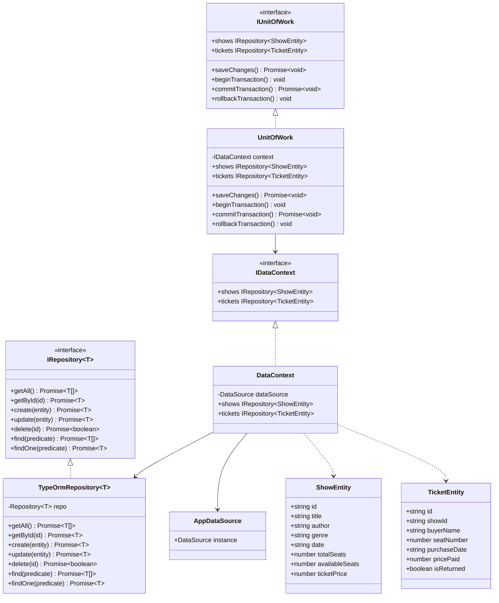
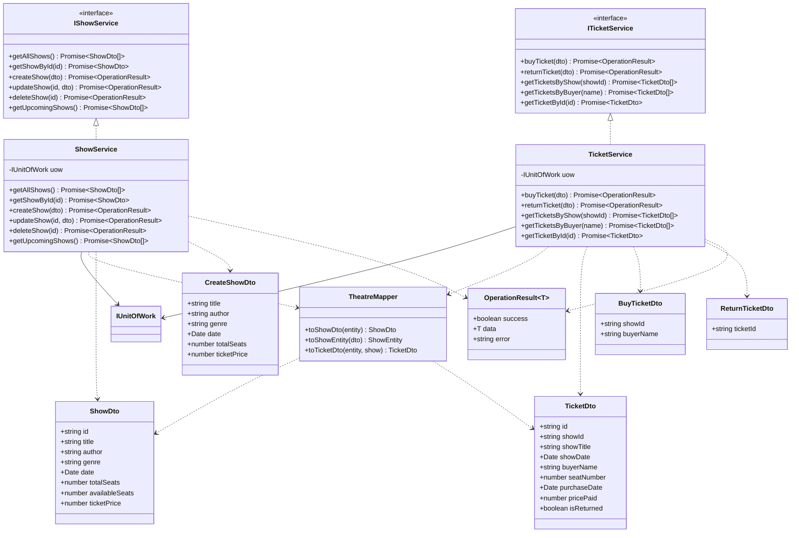
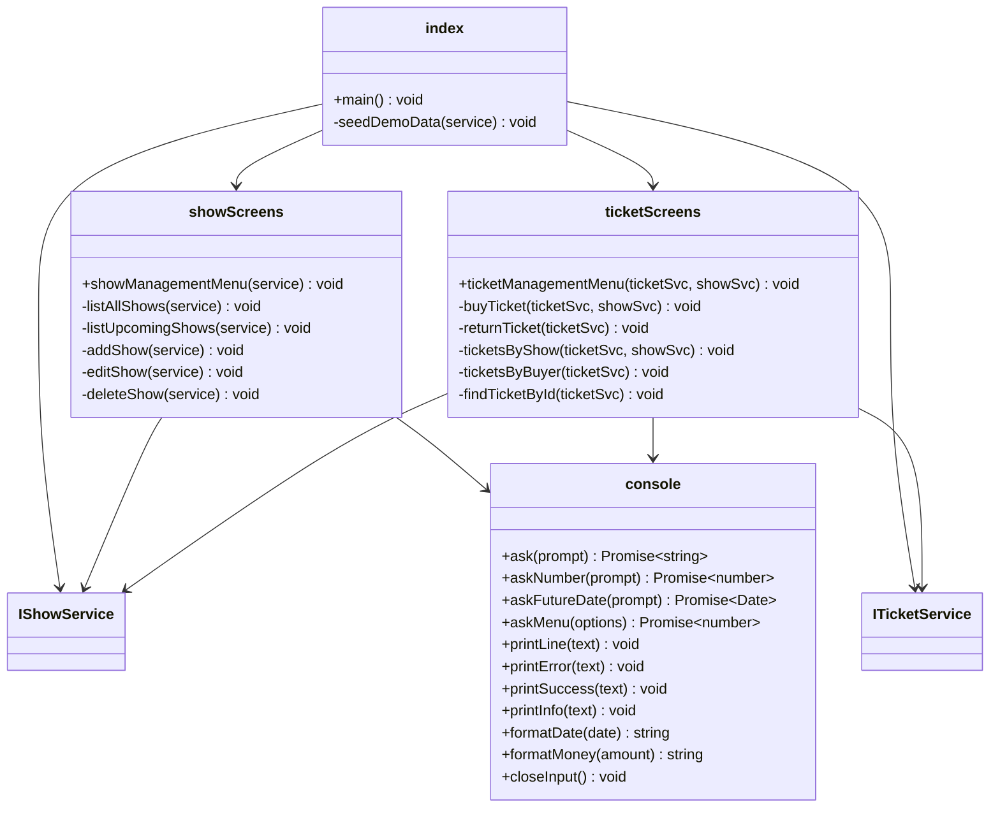

## Загальна архітектура

```
┌─────────────────────────────────────────┐
│                  UI Layer               │
│         (console, showScreens,          │
│              ticketScreens)             │
└──────────────┬──────────────────────────┘
               │ використовує
               │ IShowService, ITicketService
┌──────────────▼──────────────────────────┐
│             BLL Layer                   │
│   (ShowService, TicketService,          │
│    TheatreMapper, DTO)                  │
└──────────────┬──────────────────────────┘
               │ використовує
               │ IUnitOfWork
┌──────────────▼──────────────────────────┐
│             DAL Layer                   │
│   (UnitOfWork, TypeOrmRepository,       │
│    DataContext, Entities)               │
└─────────────────────────────────────────┘
```

---

## DAL — Data Access Layer



---

## BLL — Business Logic Layer



---

## UI Layer


